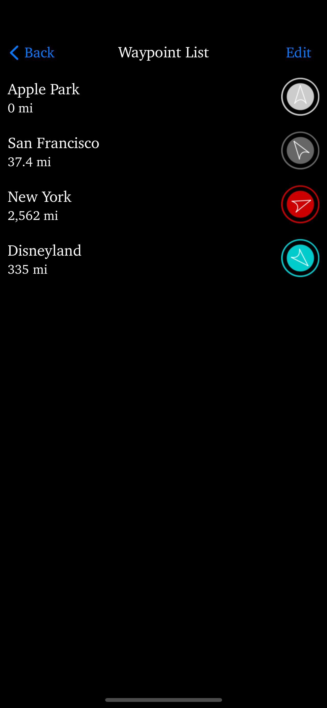

# Thataway Support

## Introduction
Thataway is a navigation tool inspired by videogame minimaps that focuses on telling you the direction your destination is in. It keeps track of multiple locations such as home base, faraway friends, and parked cars. Ideal for wandering journeys where all you need to know is if you're headed the right way.

Features:
- Compass-style main screen showing local area, heading, longitude, latitude, and the direction to all active waypoints
- Waypoints differentiated by editable colors and visually ranked by distance
- Close waypoints appear on the minimap for more precise navigation
- New waypoints can be added where you are, or with a searchable map
- List view shows distances to waypoints and toggles individual waypoint visibility on the main screen
- Name, Color, and Location of waypoints can be edited after creation
- No data transmitted off-device

## Contact
If you have any questions, comments, or concerns please contact [thatawayhelp@gmail.com](mailto:thatawayhelp@gmail.com).

## Privacy Policy
[Privacy Policy](https://matthewmarmalade.github.io/thataway-support/privacy-policy)

## Basic Functionality

### Startup
Thataway will prompt for permission to use your device's location. If you change your mind about what you choose, this can be altered later in Settings.

The main screen is shown below. 

 

The central circle contains a map of the immediate area, which rotates to align with the direction the device is pointing. Below the map is the button to add a new Waypoint. A Waypoint is a saved location. Below that button is a display of the device's current Latitude and Longitude. Above the map is the device's current heading, in degrees and as a compass direction.

### Navigating Views
At the top right of the main screen is a button titled **List**. Pressing it will take you to the List View, which shows all waypoints on a list, like so: 

 

### Adding a New Waypoint
From the main screen, tap the **New Waypoint** button to add a new Waypoint. This will add a new Waypoint at your current location, and bring up a window to edit it. Pressing **Save** in the bottom right will create the new waypoint, pressing **Cancel** in the bottom left will cancel the creation entirely.

#### Editing Name
The Name field is editable; simply tap on the Name or the **X** button to begin. Tap anywhere outside of the keyboard to dismiss the keyboard.

#### Editing Location
A preview of the Waypoint's location is shown on the map. To change this location, press the **Edit Location** button. This navigates to a larger map view. You can search for locations by tapping the top of the screen, and typing in an address. Selecting an address that comes up will take the map there and drop a pin at the address. You can also zoom and pan the map around, looking for a specific spot. The **Reset** button will bring you back to the original location of the Waypoint. The **Drop Pin** button will select the location currently within the small white circle at the centre of the screen. The **Save** button will save whatever the current pin is. To cancel, press the **<** button at the top left of the screen.

#### Editing Color
There is a collection of default colors, shown as small squares of different colors. Tap on one to select it. A selected color should show a checkmark.

##### Creating a New Color
At the end of the color collection, there is a **+** button. Pressing this button will bring up a new window to create a new color for your list. First, select the general hue with the slider at the bottom. Then, tap somewhere in the color gradient to choose a color. Make sure to consult the preview above to make sure the color is what you want. To Cancel the color creation, press the **Cancel** button. To Save the new color, press the **Save** button. If the color is saved, it will be added to the list.

##### Editing an Existing Color
When a color is already selected, it can be tapped again to edit it. If this is done by mistake, press **Cancel** to leave the color unchanged. If you do wish to edit the color, then as before select the desired hue with the slider at the bottom of the screen, tap to select the chosen color from the gradient, and press **Save** to save your changes.

##### Deleting an Existing Color
To remove an existing color from your collection, select the color by tapping it and then tap it again to bring up the editing view. Press the **Remove** button to delete this color.

### Editing an Existing Waypoint
To edit an existing Waypoint, go to the Waypoint List and tap on the Waypoint. This will bring up an editing view, similar to the view when first creating a Waypoint. As before, the Name, Location, and Color can all be edited. Pressing **Save** in the top right will save changes to the waypoint, pressing **Cancel** in the top left will discard changes.

### Deleting an Existing Waypoint
To delete a Waypoint, navigate to the Waypoint List and swipe from right to left on the desired waypoint. The entry should move sideways, revealing a **Delete** button. Press it to remove the Waypoint. Alternatively, press the **Edit** button in the top right of the Waypoint List. To delete a given Waypoint, press the red circle with a dash through it to the left of the Waypoint entry, which as before should reveal a **Delete** button to the right. Pressing this button will delete the waypoint. When you are done editing in this way, press the **Done** button at the top right of the Waypoint List.

### Toggling Visibility of a Waypoint
By default, a new Waypoint is always visible on the main screen. To hide it, go to the Waypoint List, and tap on the large circle with an arrow in it on the right of the desired Waypoint. The circle should go from filled to empty, while the arrow remains. This hides the Waypoint on the main screen. To reenable it, tap the center of that circle again, which should re-fill the circle. Note, if you are taken to the edit view instead, then you have missed the circle. Be careful to tap in the center of it.

### Changing Distance Units
To change the Units for distance that Thataway uses, go to the Settings app. Scroll down until you find an entry for Thataway. You should see a list of permissions, and then a section titled **Thataway Settings**, with a **Distance Unit** entry. Tap on that to open up a choice between Miles, Kilometres, and Nautical Miles. Select whichever unit you prefer, and Thataway should instantly update.

## Bug Reporting
Again, if there are any problems with Thataway, please contact [thatawayhelp@gmail.com](mailto:thatawayhelp@gmail.com).
