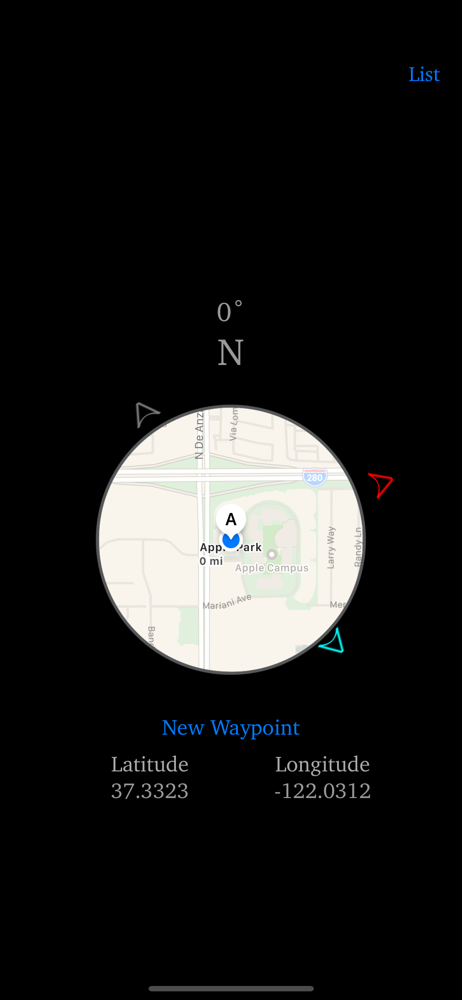

# Thataway Support

## Introduction
Thataway is a navigation tool inspired by videogame minimaps that focuses on telling you the direction your destination is in. You can keep track of multiple locations such as home base, faraway friends, and parked cars. Thataway is ideal for wandering journeys where all you need to do is head in the right direction.

Features:
- Compass-style main screen showing local area, heading, longitude, latitude, and the direction to all active waypoints
- Waypoints differentiated by editable colors and visually ranked by distance
- Close waypoints appear on the minimap for more precise navigation
- New waypoints can be added where you are, or with a searchable map
- List view shows distances to waypoints and toggles individual waypoint visibility on the main screen
- Name, Color, and Location of waypoints can be edited after creation
- No data transmitted off-device

## Contact
If you have any questions, comments, or concerns please contact thatawayhelp@gmail.com.

## Basic Functionality

### Startup
Thataway will prompt for permission to use your device's location. If you change your mind about what you choose, this can be altered later in Settings.

The main screen is shown below.

The central circle contains a map of the immediate area, which rotates to align with the direction the device is pointing. Below the map is the button to add a new Waypoint. A Waypoint is a saved location. Below that button is a display of the device's current Latitude and Longitude. Above the map is the device's current heading, in degrees and as a compass direction.

### Navigating Views
At the top right of the main screen is a button titled **List**. Pressing it will take you to the List View, which shows all waypoints on a list.

### Adding a New Waypoint

#### Editing Name

#### Editing Location

#### Editing Color

##### Creating a New Color

##### Editing an Existing Color

##### Deleting an Existing Color

### Editing an Existing Waypoint

### Deleting an Existing Waypoint

### Toggling Visibility of a Waypoint

### Changing Distance Units

## FAQ

## Bug Reporting
